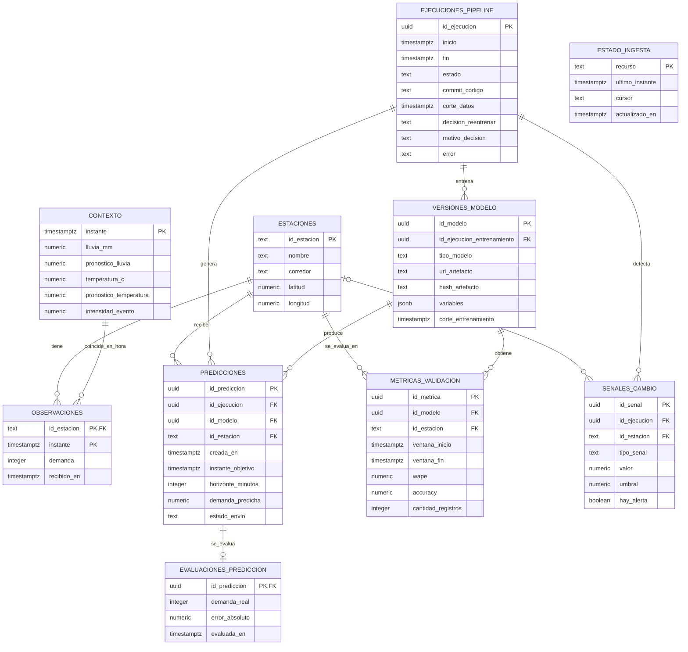

# Esquema de datos propuesto para Pulso TransMi

Este es el **diseño de la base de datos del proyecto estudiantil**. No describe la base interna de la API. La implementación SQL está en [la migración a Supabase](../supabase/README.md); este documento explica el modelo. Propongo **10 tablas** para responder tres preguntas: ¿qué datos llegaron?, ¿qué hizo cada ejecución del pipeline?, y ¿qué tan bien funcionaron sus predicciones?

## Vista rápida

| Grupo | Tablas | Para qué sirven |
|---|---|---|
| Datos de entrada | `estaciones`, `contexto`, `observaciones` | Guardan el catálogo, clima/eventos y demanda real. |
| Operación | `estado_ingesta`, `ejecuciones_pipeline`, `senales_cambio` | Permiten continuar la descarga y explicar cada ejecución o reentrenamiento. |
| Modelos y resultados | `versiones_modelo`, `metricas_validacion`, `predicciones`, `evaluaciones_prediccion` | Registran modelos, pruebas temporales, pronósticos y sus errores cuando llega el dato real. |

**Cómo leer el diagrama:** `PK` es clave primaria (identifica una fila), `FK` es clave foránea (apunta a otra tabla) y `1:N` significa «una fila puede tener muchas filas relacionadas».

## Modelo entidad–relación

`ESTADO_INGESTA` aparece sin flechas porque guarda el avance de cada descarga de la API; no pertenece a una estación o a un modelo. La línea entre `CONTEXTO` y `OBSERVACIONES` representa una **unión por hora**, no una clave foránea obligatoria: ambos recursos pueden llegar en distinto orden.

## Las 10 tablas, una por una

| # | Tabla | Una fila representa… | Clave y relación principal |
|---:|---|---|---|
| 1 | `estaciones` | Una estación del catálogo. | `id_estacion` es PK. Es **texto**: `07107` no debe convertirse en `7107`. |
| 2 | `contexto` | Clima y eventos en un instante de 15 minutos, compartidos por las 12 estaciones. | `instante` es PK. |
| 3 | `observaciones` | Demanda real de **una estación en un instante**. | PK compuesta: (`id_estacion`, `instante`); `id_estacion` apunta a `estaciones`. |
| 4 | `estado_ingesta` | Hasta dónde llegó la descarga de un recurso, por ejemplo `observations` o `context`. | `recurso` es PK; guarda último instante y, si aplica, cursor. |
| 5 | `ejecuciones_pipeline` | Una ejecución automática o manual, incluso si falla. | `id_ejecucion` es PK; registra fecha, commit, corte de datos, decisión de reentrenar y error. |
| 6 | `versiones_modelo` | Un baseline o una versión entrenada del modelo. | `id_modelo` es PK; `id_ejecucion_entrenamiento` apunta a la ejecución que la creó. |
| 7 | `metricas_validacion` | Resultado de **un modelo en una estación y una ventana temporal**. | `id_metrica` es PK; apunta a `versiones_modelo` y `estaciones`. |
| 8 | `predicciones` | Un pronóstico para **una estación, un instante futuro y un horizonte**. | `id_prediccion` es PK; apunta a ejecución, modelo y estación. |
| 9 | `evaluaciones_prediccion` | Comparación de una predicción con la demanda real, cuando ya se conoce. | `id_prediccion` es PK y FK a `predicciones`: máximo una evaluación por predicción. |
| 10 | `senales_cambio` | Una medición de drift o alerta calculada durante una ejecución. | `id_senal` es PK; apunta a ejecución. `id_estacion` es opcional si la señal es global. |

## Ejemplo concreto de las relaciones

Supongamos la estación **`07107`** y el instante **`2026-09-08 17:00:00-05:00`**:

1. `estaciones` tiene **una** fila para `07107`.
2. `contexto` tiene **una** fila para las 17:00; esa misma fila de clima/eventos puede relacionarse con las observaciones de las **12** estaciones a esa hora.
3. `observaciones` tiene **una** fila con la demanda real de `07107` a las 17:00. Su par (`id_estacion`, `instante`) impide duplicados.
4. Una `ejecuciones_pipeline` puede entrenar una `versiones_modelo`, guardar sus resultados en `metricas_validacion` y generar muchas `predicciones`.
5. Una predicción para `07107` a las 17:00 se cruza con esa observación real; entonces se crea **una** `evaluaciones_prediccion` con el error absoluto.

Así se puede seguir el recorrido completo: **dato real → ejecución → modelo → predicción → evaluación**.

## Reglas para implementarlo después

- Usar `timestamptz` para almacenar horas y mostrarlas en `America/Bogota`. Las fechas de la API incluyen zona horaria.
- Al reanudar una descarga, consultar de nuevo el último instante y hacer `upsert` de `observaciones` por (`id_estacion`, `instante`). Los filtros de la API son inclusivos; esto evita pérdidas y duplicados.
- Exigir demanda real y predicha no negativas; horizonte mayor que cero; `instante_objetivo` posterior a `creada_en`.
- Impedir dos pronósticos iguales dentro de una ejecución con `UNIQUE(id_ejecucion, id_estacion, instante_objetivo, horizonte_minutos)`. Otras ejecuciones sí pueden pronosticar el mismo objetivo.
- Indexar `observaciones(instante)`, `predicciones(id_estacion, instante_objetivo)` y las claves usadas para consultar métricas y señales por ejecución.
- `evaluaciones_prediccion.demanda_real` se obtiene al unir `predicciones` con `observaciones` por estación e instante objetivo. El valor se guarda para conservar la evaluación histórica; si la API corrige un dato, la evaluación debe recalcularse de forma explícita.
- WAPE se calcula **sobre un conjunto de predicciones**, no por fila: `SUM(error_absoluto) / SUM(demanda_real)`. Se calcula por estación y después se promedia, según el README del reto.
- El archivo del modelo se guarda fuera de la base de datos; `versiones_modelo` conserva la ubicación, hash y variables usadas.

**Pendiente:** el reto todavía no publica el contrato final para enviar predicciones ni los cuatro horizontes exactos. Por eso `horizonte_minutos` es flexible y no propongo aún tablas para usuarios, leaderboard o envíos externos.
