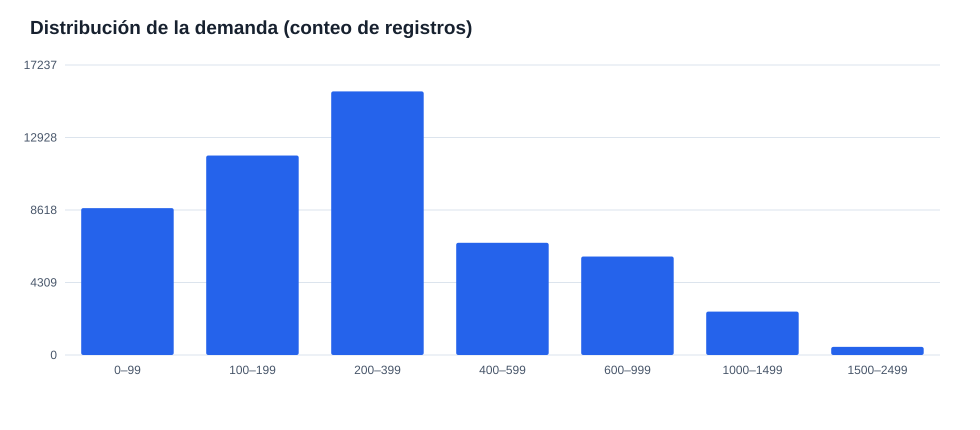
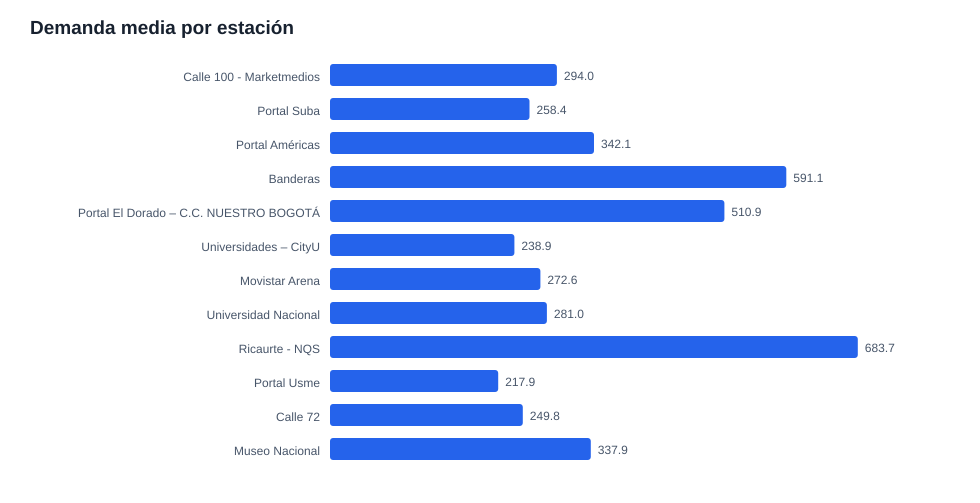
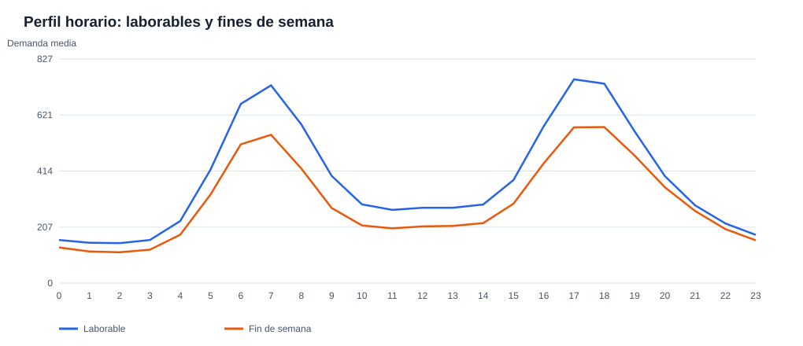
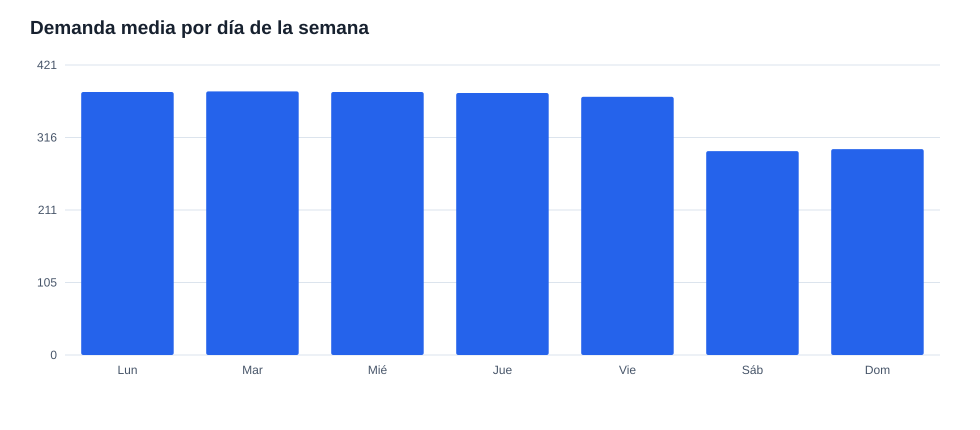
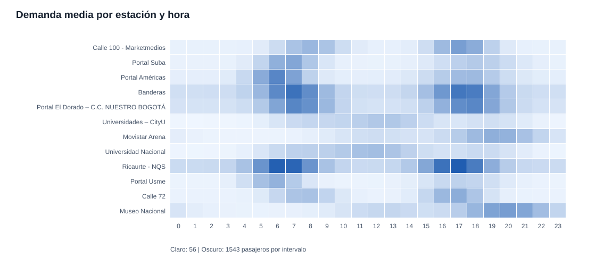
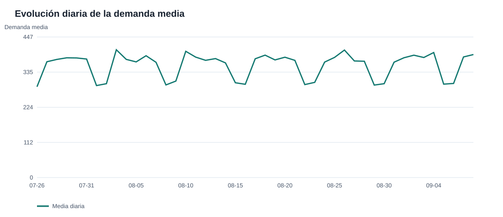

# Análisis exploratorio — Pulso TransMi

[**Abrir dashboard interactivo**](dashboard.html): filtra por estación y consulta los ejes, unidades y valores al pasar el cursor. Para regenerarlo: `python3 eda/build_dashboard.py`.

Fuente: API pública `https://pulso-transmi.72-60-245-2.sslip.io`. Snapshot local de la respuesta, versión `0.2.0`; fecha declarada de generación `2026-09-16`. Para rehacer los gráficos con este snapshot: `python3 eda/run_eda.py`. Para descargar una versión nueva: `python3 eda/run_eda.py --refresh`. Se usa solo la biblioteca estándar de Python.

## Tamaño, esquema y faltantes

| Archivo | Filas | Faltantes por campo |
|---|---:|---|
| stations | 12 | station_id: 0, station_name: 0, corridor: 0, latitude: 0, longitude: 0 |
| observations | 51,840 | observed_at: 0, station_id: 0, demand: 0 |
| context | 4,320 | observed_at: 0, rain_mm: 0, rain_forecast: 0, temperature_c: 0, temperature_forecast: 0, event_intensity: 0 |

**Total de celdas vacías:** 0. Los CSV contienen 51,840 observaciones (`observed_at`, `station_id`, `demand`), 4,320 filas de contexto y 12 estaciones. Los IDs se conservan como texto para no perder ceros iniciales.

La ventana va de **2026-07-26T00:00:00-05:00** a **2026-09-08T23:45:00-05:00**. Hay 4,320 instantes distintos, 0 saltos de frecuencia, 0 claves `(hora, estación)` duplicadas y 0 combinaciones estación–hora ausentes dentro de la grilla observada. Contexto: 0 horas duplicadas; 0 horas de demanda sin contexto; 0 horas de contexto sin demanda. 0 estaciones del catálogo carecen de observaciones y 0 IDs de observación no figuran en el catálogo.

Hashes SHA-256 del snapshot: `stations.csv` `d4dea46ceee2fb3ebe76362fbaa925c95b586130270c0998438f42494a7471ef`, `observations.csv` `ecc6a32174f84e810c4b684db52f5e4eebd815f11f5e5b22d3574116b837eacd`, `context.csv` `891f422628cc5033eaf89a1e8f7e69edab65afba1495a8072d2b395965d7656d`.

## Distribución de la demanda

La demanda es entera, con mínimo **14**, mediana **263**, media **356.5**, percentil 95 **1,057**, percentil 99 **1,481** y máximo **2,284**. Hay **0 ceros** y **0 negativos**. El total acumulado es **18,482,146**. La media supera la mediana y hay una cola de intervalos con demanda alta.

**Ejes:** X = rangos de pasajeros por estación en un intervalo de 15 minutos; Y = número de registros. Los rangos tienen amplitudes distintas.

## Diferencias entre estaciones

La estación con mayor media es **Ricaurte - NQS** (683.7); la menor es **Portal Usme** (217.9). Esta variación exige mirar métricas por estación y no solo una media global.

| ID | Estación | Registros | Media | Mediana | P95 | Máximo | Cambio primera vs. última semana |
|---|---|---:|---:|---:|---:|---:|---:|
| 02300 | Calle 100 - Marketmedios | 4,320 | 294.0 | 158 | 909 | 1,472 | +4.3% |
| 03000 | Portal Suba | 4,320 | 258.4 | 153 | 754 | 1,252 | +3.0% |
| 05000 | Portal Américas | 4,320 | 342.1 | 201 | 974 | 1,944 | +1.3% |
| 05100 | Banderas | 4,320 | 591.1 | 392 | 1369 | 2,065 | +3.0% |
| 06000 | Portal El Dorado – C.C. NUESTRO BOGOTÁ | 4,320 | 510.9 | 340 | 1205 | 1,789 | +1.3% |
| 06111 | Universidades – CityU | 4,320 | 238.9 | 207 | 569 | 835 | +3.8% |
| 07105 | Movistar Arena | 4,320 | 272.6 | 214 | 729 | 1,313 | +4.6% |
| 07107 | Universidad Nacional | 4,320 | 281.0 | 248 | 662 | 982 | +6.0% |
| 07111 | Ricaurte - NQS | 4,320 | 683.7 | 452 | 1627 | 2,284 | +3.2% |
| 09000 | Portal Usme | 4,320 | 217.9 | 128 | 629 | 1,071 | +4.7% |
| 09122 | Calle 72 | 4,320 | 249.8 | 134 | 768 | 1,249 | +1.2% |
| 10009 | Museo Nacional | 4,320 | 337.9 | 266 | 910 | 1,434 | +2.9% |

El cambio compara dos ventanas completas de siete días, con la misma mezcla de días de la semana. Es descriptivo; no prueba una deriva estadística ni explica su causa.

**Ejes:** X = pasajeros promedio por intervalo de 15 minutos; Y = estación.

## Ciclos horarios y semanales

La hora de mayor media global es **17:00–17:59** (701.1 por intervalo); la menor es **02:00–02:59** (137.8). El perfil tiene picos de mañana y tarde, pero la forma cambia entre estaciones: algunas concentran demanda al mediodía o en la noche.

**Ejes:** X = hora local de Bogotá; Y = pasajeros promedio por estación e intervalo de 15 minutos.

Las medias por día (lunes a domingo) son: 381.8, 382.8, 381.9, 380.4, 374.9, 296.1, 298.9. Los fines de semana son claramente más bajos; para modelar conviene conservar hora, día de la semana y estación.

**Ejes:** X = día de la semana; Y = pasajeros promedio por estación e intervalo de 15 minutos.

**Ejes:** X = hora local; Y = estación. Color más oscuro = mayor demanda promedio por intervalo de 15 minutos.

Horas con mayor demanda media por estación (cada hora agrupa cuatro intervalos):

| Estación | Hora pico | Media por intervalo en esa hora |
|---|---:|---:|
| Calle 100 - Marketmedios | 17:00 | 910.4 |
| Portal Suba | 07:00 | 826.5 |
| Portal Américas | 06:00 | 1139.6 |
| Banderas | 07:00 | 1338.4 |
| Portal El Dorado – C.C. NUESTRO BOGOTÁ | 07:00 | 1143.3 |
| Universidades – CityU | 13:00 | 503.1 |
| Movistar Arena | 19:00 | 744.5 |
| Universidad Nacional | 12:00 | 600.4 |
| Ricaurte - NQS | 17:00 | 1543.3 |
| Portal Usme | 06:00 | 717.0 |
| Calle 72 | 17:00 | 762.4 |
| Museo Nacional | 20:00 | 918.1 |

El promedio laborable es **380.5** y el de fin de semana es **297.6**: una diferencia de **21.8%**.

## Evolución temporal y contexto

La serie diaria muestra variación cíclica. Las medias de la primera y última semana son **352.1** y **363.0**, respectivamente. Se requiere validación temporal para saber si esta diferencia altera el error predictivo.

**Ejes:** X = fecha local; Y = pasajeros promedio por estación e intervalo de 15 minutos en ese día.

Las variables de contexto tienen cobertura completa. Resumen:

| Variable | Mínimo | Media | P95 | Máximo | Ceros |
|---|---:|---:|---:|---:|---:|
| `rain_mm` | 0.000 | 0.260 | 1.171 | 7.722 | 5 |
| `rain_forecast` | 0.000 | 0.381 | 1.376 | 7.461 | 1,569 |
| `temperature_c` | 6.753 | 14.507 | 20.515 | 22.321 | 0 |
| `temperature_forecast` | 5.449 | 14.506 | 20.767 | 23.568 | 0 |
| `event_intensity` | 0.000 | 0.032 | 0.135 | 1.000 | 453 |

La coincidencia temporal permite unir contexto y demanda por `observed_at`. Cualquier relación entre lluvia, temperatura o eventos y demanda debe evaluarse controlando estación, hora y día; una comparación simple puede reflejar esos ciclos. Para evitar filtración temporal, usar en predicción solo variables que estén disponibles al momento de pronosticar (por ejemplo, pronósticos, no mediciones futuras). Según el README, demanda, clima y eventos son sintéticos.

## Implicaciones para el proyecto

1. Empezar con un baseline que tenga estación, hora y día de la semana, y medir WAPE por estación.
2. Separar entrenamiento y validación cronológicamente; el README propone 38 días y 7 días.
3. Registrar fecha de corte y hash del snapshot. La API puede liberar nuevas observaciones, así que este informe describe solo el snapshot indicado.
4. Investigar los intervalos de demanda extrema y las variables de contexto antes de definir reglas de reentrenamiento.
